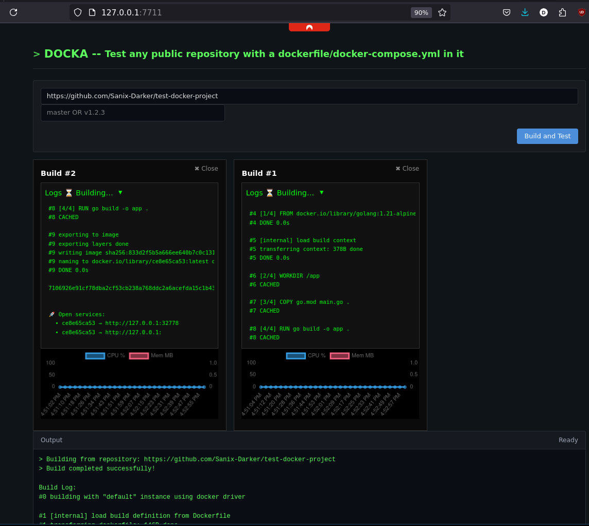

# DOCKA

<p align="center">
  <strong>Build, test, and run any public Git repository with Docker — instantly.</strong>
</p>

<p align="center">
  
</p>

## Overview

Docka is a self-hosted service that lets you quickly spin up sandboxed Docker environments from any public Git repository that contains a `Dockerfile` or `docker-compose.yml`. Perfect for:

- Testing open-source projects without cluttering your local environment
- Quick demos and proof-of-concepts
- CI/CD previews and ephemeral environments
- Learning and experimentation

## Features

- **One-click deployment**: Just paste a Git URL and click "Build & Run"
- **Multi-provider support**: Works with GitHub, GitLab, and Bitbucket
- **Docker Compose support**: Automatically handles multi-service applications
- **Live logs**: Stream build and runtime logs in real-time
- **Resource monitoring**: CPU and memory usage charts for each container
- **Auto-cleanup**: Containers automatically terminate after a configurable TTL
- **Rate limiting**: Built-in protection against abuse
- **Security hardened**: Sandboxed containers with resource limits and network isolation

## ⚠️ Disclaimer

This project is intended for **testing and development purposes only**. Running arbitrary Docker containers from the internet carries inherent security risks. Use at your own discretion and never expose to untrusted networks without proper security measures.

## Prerequisites

- Linux host (or WSL2) with **Docker ≥ 24** and the **docker compose** plugin
- PHP 8.1+ with extensions: `sockets`, `json`, `pcntl`
- Git
- Root privileges (required for iptables and Docker socket access)

## Quick Start

### Local Development

```bash
# Clone the repository
git clone https://github.com/sanix-darker/docka.git
cd docka

# Install dependencies
composer install

# Create directories
mkdir -p builds logs

# Start the development server (requires root for Docker/iptables)
sudo php -S 0.0.0.0:7711 -t public
```

Visit `http://localhost:7711` and paste a repository URL to get started.

### Docker Deployment (DinD)

```bash
# Build the image
docker build -t docka .

# Run with Docker-in-Docker
docker run -d \
  --name docka \
  --privileged \
  -p 81:80 \
  -v docka-docker:/var/lib/docker \
  docka
```

> **Note**: The `--privileged` flag is required for Docker-in-Docker. For production, consider using a dedicated VM or proper container security measures.

## Configuration

Edit `config/config.php` to customize behavior:

```php
return [
    // Container lifetime (seconds)
    'container_ttl_seconds' => 3600,

    // Resource limits per container
    'limits' => [
        'memory' => '512m',
        'cpus'   => '0.5',
        'pids'   => 100,
    ],

    // Rate limiting
    'rate_limit' => [
        'builds_per_ip_per_hour' => 10,
        'max_concurrent_builds'  => 5,
        'max_per_session'        => 3,
    ],

    // Allowed Git hosts (empty = allow all)
    'allowed_hosts' => [
        'github.com',
        'gitlab.com',
        'bitbucket.org',
    ],
];
```

## Architecture

```
┌─────────────────────────────────────────────────────────────┐
│                        Browser                               │
│  ┌─────────────┐  ┌─────────────┐  ┌─────────────┐          │
│  │  Build Form │  │  Log Viewer │  │ Stats Chart │          │
│  └──────┬──────┘  └──────┬──────┘  └──────┬──────┘          │
└─────────┼────────────────┼────────────────┼──────────────────┘
          │                │                │
          ▼                ▼                ▼
┌─────────────────────────────────────────────────────────────┐
│                     PHP Backend                              │
│  ┌──────────┐  ┌────────────┐  ┌───────────────┐            │
│  │ build.php│  │  tail.php  │  │   stats.php   │            │
│  └────┬─────┘  └─────┬──────┘  └───────┬───────┘            │
│       │              │                  │                    │
│       ▼              ▼                  ▼                    │
│  ┌──────────────────────────────────────────────────┐       │
│  │                  Core Classes                     │       │
│  │  Sandbox → RepositoryManager → DockerManager     │       │
│  │            RateLimiter        Utils              │       │
│  └──────────────────────────────────────────────────┘       │
└─────────────────────────┬────────────────────────────────────┘
                          │
                          ▼
┌─────────────────────────────────────────────────────────────┐
│                    Docker Engine                             │
│  ┌─────────────┐  ┌─────────────┐  ┌─────────────┐          │
│  │ Container 1 │  │ Container 2 │  │ Container N │          │
│  └─────────────┘  └─────────────┘  └─────────────┘          │
└─────────────────────────────────────────────────────────────┘
```

## Security Measures

Docka implements multiple layers of security:

### Input Validation
- URL validation with allowed host whitelist
- Git ref sanitization (branch/tag names)
- Environment variable content validation
- CSRF token protection on all forms

### Rate Limiting
- Per-IP request limits (minute and hour windows)
- Concurrent build limits
- Per-session sandbox limits

### Container Isolation
- Memory and CPU limits
- PID limits (prevent fork bombs)
- Dropped capabilities
- `no-new-privileges` security option
- Automatic TTL-based cleanup

### Repository Validation
- Maximum repository size check
- Symlink traversal prevention
- Blocked Dockerfile patterns (privileged mode, host network)

## API Endpoints

| Endpoint | Method | Description |
|----------|--------|-------------|
| `/build.php` | POST | Start a new build |
| `/stop.php` | GET | Stop a running sandbox |
| `/tail.php` | GET | Stream log file content |
| `/stats.php` | GET | Get container resource stats |

### Build Request

```javascript
const formData = new FormData();
formData.append('repo', 'https://github.com/user/repo');
formData.append('ref', 'main');  // optional
formData.append('env', 'KEY=value');  // optional
formData.append('_csrf', csrfToken);

const response = await fetch('/build.php', {
    method: 'POST',
    body: formData,
});
```

### Response

```json
{
    "ok": true,
    "sandboxId": "abc123xyz789",
    "ports": [
        {"service": "web", "hostPort": 32768, "containerPort": 81}
    ],
    "containerIds": ["abc123xyz789"],
    "ttl": 3600
}
```

## Troubleshooting

### Container fails to start

1. Check the logs in the UI for build errors
2. Verify the repository has a valid `Dockerfile` or `docker-compose.yml`
3. Ensure Docker daemon is running: `docker info`

### Rate limit exceeded

Wait for the cooldown period or adjust limits in `config/config.php`.

### Port conflicts

Docka automatically allocates free ports in the range 32768-60999. If you're running many containers, some may fail due to port exhaustion.

### Permission denied

Docka requires root privileges for:
- Docker socket access
- iptables manipulation
- Binding to ports < 1024

## Development

```bash
# Run with verbose errors
php -d display_errors=1 -S 0.0.0.0:7711 -t public

# Watch logs
tail -f logs/docka.log

# Clean up all sandboxes
./cleanup.sh
```

## Contributing

Contributions are welcome! Please:

1. Fork the repository
2. Create a feature branch
3. Submit a pull request

## License

MIT License - See [LICENSE](LICENSE) for details.

## Author

Made with ❤️ by [sanixdk](https://github.com/sanix-darker)
